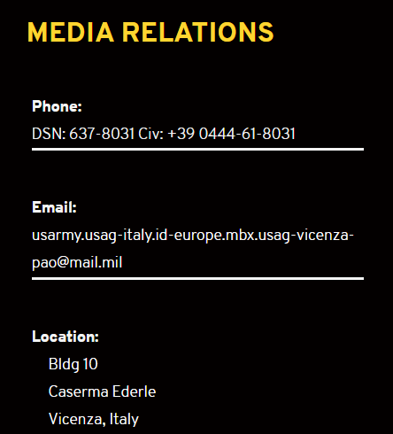

# Разведчик

|   Событие    | Название  | Категория | Сложность |
| :----------: | :-------: | :-------: | :-------: |
| VKA-CTF`2020 | Разведчик |   OSINT   |  АБИТУРА  |

## Описание

> Автор: Rex
>
> Сбор развед данных
> 
> Доложите нам об обстановке Defender Europe 2020

## Решение

##### Какой email-адрес у военного гарнизона НАТО в Италии?

Гарнизоны НАТО в Европе 

https://www.eur.army.mil/Garrisons/

(для получения доступа можете воспользоваться TouchVPN и поменять на Unated States)

Переходим на гарнизоны в Италии (сменяем VPN на Итальянский)

https://home.army.mil/italy/index.php/contact/media-relations

###### Ответ:

> usarmy.usag-italy.id-europe.mbx.usag-vicenza-pao@mail.mil

##### В какие в итоге учения переросли несостоявшиеся Defender 2020?

https://www.7atc.army.mil/AlliedSpirit/

###### Ответ:

> Allied Spirit

##### Сколько абрамсов вы насчитали на учениях в Польше?

https://www.eur.army.mil/Portals/19/documents/DEFENDEREurope/DEFENDEREurope20-AlliedSpirit200602(1).pdf?ver=2020-06-02-085843-487

(Здесь же упоминание о Allied Spirit)

###### Ответ:

> 85

##### На какую дату были перенесены учения Defender? (дд.мм.гг)

https://www.eur.army.mil/Portals/19/documents/DEFENDEREurope/PressBriefingonUSPolishcooperationinAlliedSpirit200609.pdf?ver=2020-06-10-053335-573

Ответ:

> 5.06.2020

##### Какое количество солдат США примут участие на учениях в Польше?

Из предыдущих источников находим количество личного состава армии США принимающего учения в Польше

###### Ответ:

> 4000

Ответив на вопросы получаем флаг:

> vka{zduxb0va_g4p7ugho_zguoz9hp_mwhifyrp_kx8zybch}