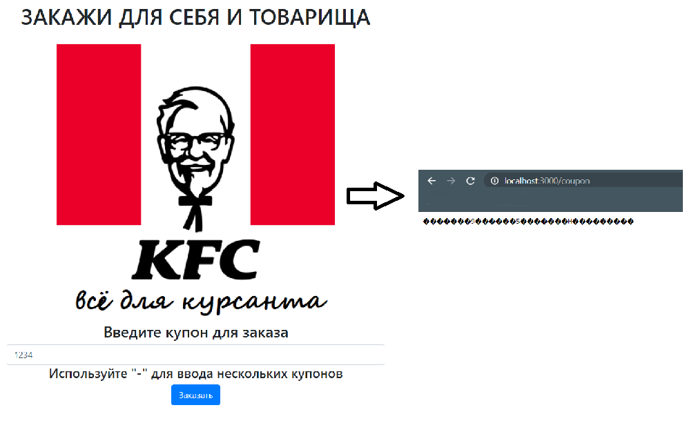
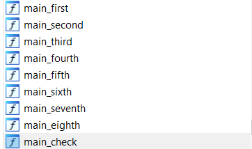
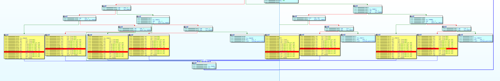
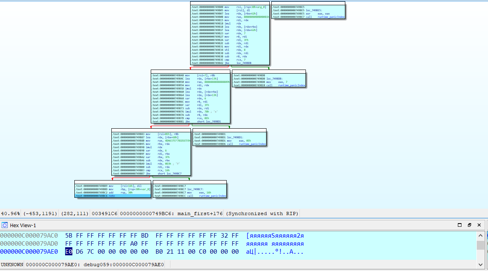

# Полковник Сандерс

|   Событие    |     Название      |      Категория      | Стоимость |
| :----------: | :---------------: | :-----------------: | :-------: |
| VKA-CTF`2020 | Полковник Сандерс | Обратная разработка |    КМБ    |

## Описание

> Автор: Rex
>
> Ох уж этот коронавирус. Нас закрыли в казарме и выпускают по одному.
> Для нас даже полковник Сандерс придумал акцию "Закажи себе и товарищу".
> Теперь можно заказывать несколько купонов сразу... Закажешь?

## Решение

Запустив сервис видим форму ввода купона, попробовав ввести случайный купон, на выходе получаем строку из 32 байт (предположительно и есть наш флаг)

Внимание привлекает функция check и связанные с ней:

В main_license проходит проверка на допустимые символы в купоне, затем по регулярному выражению [\\d\\w]{4} набор купонов из вида 1111-2222-3333-... по порядку обрабатывается с первой по восьмую функцию, если купон соответствующей длины (1111 -> main_first, 2222 -> main_second, ... 8888 -> main_eighth)

В качестве аргумента для функций проверок также используется наш флаг инициализированный 0xFF * 32. 

main_first представляет собой следующий алгоритм:

***
c = Atoi(coupon);

flag[0] = ((c % 7310) % 255);

flag[7] = ((c + 98 % 255);

flag[14] = ((c +19) % 120);

flag[22] = ((c + 104) % 211);

***

Пример прохождения функции для первого купона 1111:

Учитывая что флаг формата VKACTF{*}

Пробуем подставить ближайшее значение таким, чтобы первый символ был "V" - 7396

main_second:
***
c = Atoi(coupon);

if (c < 0xFF){

​	flag[1] = (((c + 30) / 18) % 255);

​	flag[8] = (((c + 34) / 28) % 255);

​	flag[15] = (((c + 95) / 15) % 255);

​	flag[23] = (((c + 95) / 15) % 255);

}

***

Используя Z3 <u>(да и в принципе стоит использовать его для всех восьми функций)</u> одним из возможных решений для второй ф-ции является изъезженное число 1337

Пройдя все восемь функций находим валидный набор купонов

> 7396-1337-0065-5967-5376-08c0-ac5b-e400

И получаем флаг

> VKACTF{c0l0n3l____SaNd3rs____s0lv3d}

