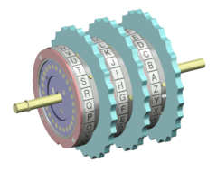
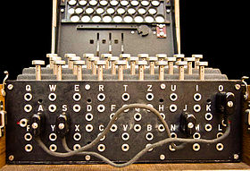
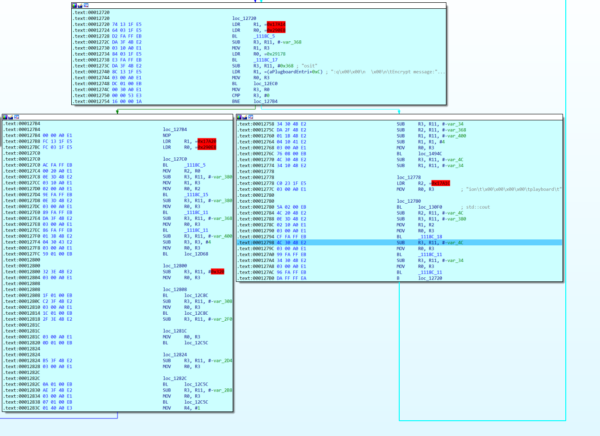
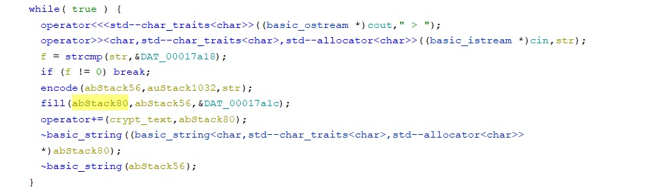
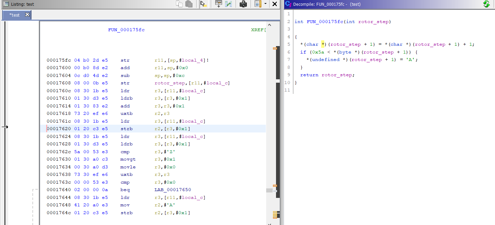
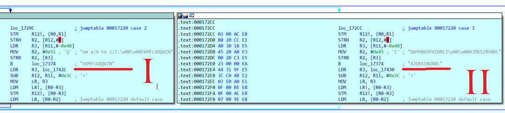
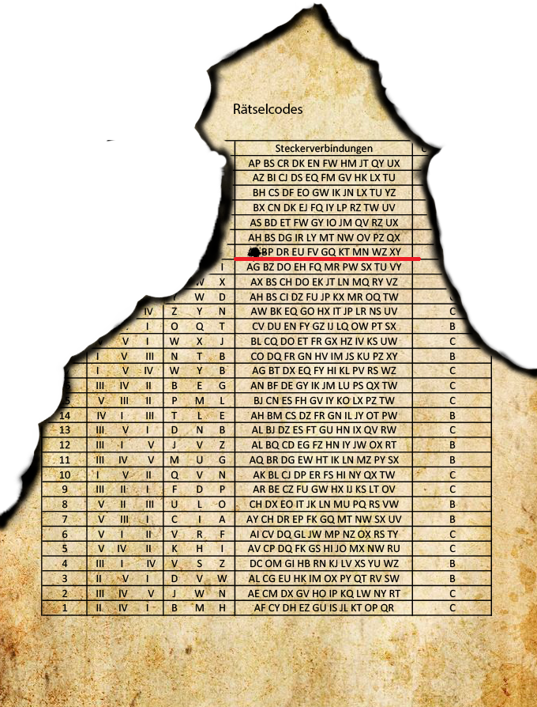
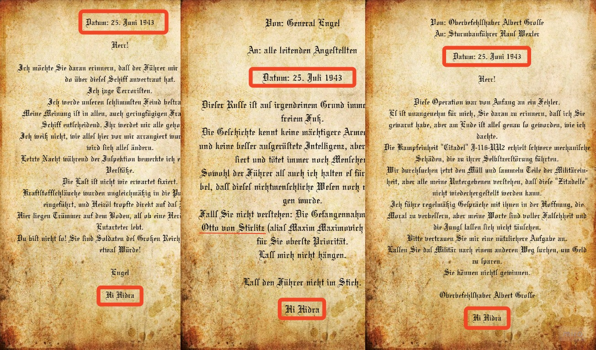
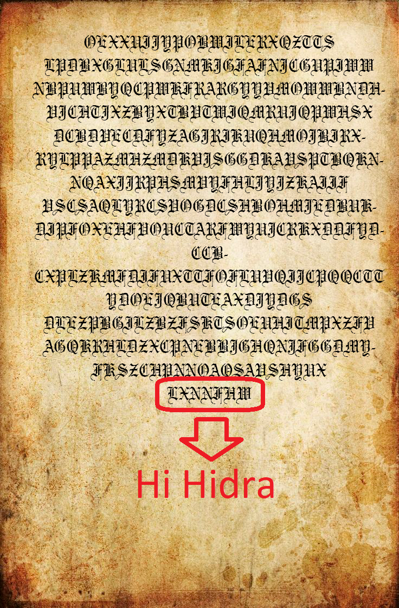
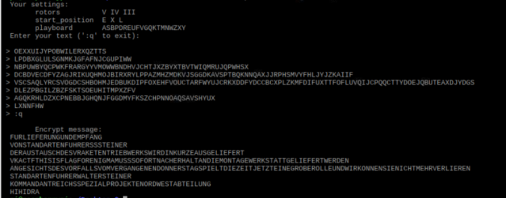

# Энигма


|   Событие    | Название |      Категория      | Стоимость |
| :----------: | :------: | :-----------------: | :-------: |
| VKA-CTF`2020 |  Энигма  | Обратная разработка | 4-5 курс  |

## Описание

> Автор: Rex
>
> Наша разведка неплохо потрудилась достав с фронта образец новой шифровальной машины Hydra. Мы даже раздобыли несколько сообщений из генерального штаба. Поняв принцип работы вы обеспечите нам большое преимущество в расшифровке данных противника. Попробуйте расшифровать переписку которую мы перехватили в тот же день, что и всю оставшуюся информацию.

## Решение

Сэмулировав ARM или запустив программу на Raspberry, начинаем вникать в логику криптомашины:

Если кто еще не изучал устройство энигмы, то очень коротко для вас:

Энигма представляет собой роторную машину (выбираются 3 неповторяющихся ротора из 5). Каждый ротор представляет собой шестеренку с нанесенной на нее алфавитом. 



После установки роторов происходит настройка их изначального положения.

В качестве дополнительной надстройки для защиты используется коммутационная панель (вообще она может иметь до 13 подключений, но по условию у нас строго 10).



Последний элемент - рефлектор, он соединяет контакты последнего кольца (эта часть энигмы как раз и позволяет использовать машину для дешифровки таким же образом, что и шифрование)

Сравнение с строкой для выхода ":q" и шифрование в цикле



Или так



Шаги роторов



Частичный псевдокод
```
    rotor_step = toupper((uint)symbol);
    symbol = (byte)rotor_step;
    if ((0x40 < symbol) && (symbol < 0x5b)) { // A - Z
    
    //Поворот 3 роторов
    
      uVar3 = FUN_00015288(iParm2,0);
      turn1 = FUN_000175bc(uVar3);
      uVar3 = FUN_00015288(iParm2,1);
      turn2 = FUN_000175bc(uVar3);
      rotor_step = FUN_00015288(iParm2,0);
      func_rotor_step(rotor_step);
      if (turn2 == 0) {
        if (turn1 != 0) {
          rotor_step = FUN_00015288(iParm2,1);
          func_rotor_step(rotor_step);
        }
      }
      else {
        rotor_step = FUN_00015288(iParm2,1);
        func_rotor_step(rotor_step);
        rotor_step = FUN_00015288(iParm2,2);
        func_rotor_step(rotor_step);
      }
    // Plugboard in
      pbVar2 = (byte *)func_plb(iParm2 + 0x6c,&symbol);
      symbol = *pbVar2;
      char_in = FUN_000153b4(iParm2);
      while (rotor_step = FUN_000153dc(iParm2), rotor_step != char_in) {
    	  // replace char_in
        symbol = FUN_0001743c(char_in,(uint)symbol,0);
        char_in = char_in + 0x1c;
      }
    // Reflector
      symbol = FUN_00016d7c(iParm2 + 0x54,(uint)symbol);
      FUN_00015408(auStack40,iParm2);
      while( true ) {
        FUN_00015464(auStack24,iParm2);
        rotor_step = FUN_0001549c(auStack40,auStack24);
        if (rotor_step == 0) break;
        uVar3 = FUN_0001550c(auStack40);
        symbol = FUN_0001743c(uVar3,(uint)symbol,1);
        FUN_000154d4(auStack40);
      }
    // Plugboard out
      pbVar2 = (byte *)func_plb(iParm2 + 0x6c,&symbol);
      symbol = *pbVar2;
      operator__(output,symbol);
    }
    FUN_000151e8(&local_20);
  }
  return2 output;
```
Инициализация роторов 



Разобравшись с устройством данной энигмы, теперь мы можем начать поиски дешифраторов/скриптовых энигм имеющих те же настройки и работающие точно также. Ищем на решение на git, не самим же писать)

### Какие выводы мы можем сделать из пересланных сообщений?


1) Дата отправки сообщений **25** июня 1943 года (по условию: "расшифровать переписку которую мы перехватили **в тот же день**"), значит в таблице используемых кодов ищем наши настройки в соответствующей строке



2) Во всех сообщениях повторяется одна и та же фраза "**hi hidra**" - скорее всего она же и стоит в конце шифротекста.





После каждого символа, прошедшего через криптоначинку состояние роторов меняется (такое же вращение как в оригинале машины). Мы можем перебрать возможные изначальные состояния роторов, подать такое же количество символов, что и в зашифрованном сообщении, дойти до hi hidra и сравнить нашу модель с зашифрованным текстом.

Таким образом нам надо перебрать 3 ротора, их изначальные положения, 1 из неиспользуемых символов и рефлектор.

Грубо написанный на скорую руку код и библиотека с gitlab позволяют решить такую задачу 
```
#include <iostream>
#include <thread>
#include "enigma_m3.hpp"

using namespace enigma;
void solve(int p){

 char start_rotor_position[26] = {'A', 'B', 'C', 'D', 'E', 'F', 'G', 'H', 'I', 'J', 'K', 'L', 'M', 'N', 'O', 'P', 'Q', 'R', 'S', 'T', 'U', 'V', 'W', 'X', 'Y', 'Z'}; 
rotor::rotor_type const_rotors[5] = {
rotor::ROTOR_I, rotor::ROTOR_II, rotor::ROTOR_III, rotor::ROTOR_IV, rotor::ROTOR_V
};

char plgb[6] = {'C', 'H', 'I', 'J', 'L', 'S'};

  reflector refl { reflector::REFLECTOR_B };
  for(int i=0; i<26; i++){
    for(int j=0; j<26; j++){
      for(int k=0; k<26; k++){
        for(int x=0; x< 5; x++){
          for(int y=0; y< 5; y++){
            for(int z=0; z< 5; z++){
              if ((x != y)){

                rotor rotorA { const_rotors[x], start_rotor_position[i] }; 
                rotor rotorB { const_rotors[y], start_rotor_position[j] };
                rotor rotorC { const_rotors[z], start_rotor_position[k] };        

                enigma_m3 e {{ rotorA, rotorB, rotorC }, refl };

                e.set_plugboard({ {'a', plgb[p]}, {'b', 'p'}, {'d', 'r'}, {'e', 'u'}, {'f', 'v'}, {'g', 'q'}, {'k', 't'}, {'m', 'n'}, {'w', 'z'}, {'x', 'y'} });

                e.encode("OEXXUIJYPOBWILERXQZTTS");
                e.encode("LPDBXGLULSGNMKJGFAFNJCGUPIWW");
                e.encode("NBPUWBYQCPWKFRARGYYVMOWWBNDHVJCHTJXZBYXTBVTWIQMRUJQPWHSX");
                e.encode("DCBDVECDFYZAGJRIKUQHMOJBIRXRYLPPAZMHZMDKVJSGGDKAVSPTBQKNNQAXJJRPHSMVYFHLJYJZKAIIF");                					e.encode("VSCSAQLYRCSVOGDCSHBOHMJEDBUKDIPFOXEHFVOUCTARFWYUJCRKXDDFYDCCBCXPL
                ZKMFDIFUXTTFOFLUVQIJCPQQCTTYDOEJQBUTEAXDJYDGS");
                auto c = e;
                e.encode("DLEZPBGILZBZFSKTSOEUHITMPXZFV");
                auto b = e;
                e.encode("AGQKRHLDZXCPNEBBJGHQNJFGGDMYFKSZCHPNNOAQSAVSHYUX");
                auto a = e.encode("HIHIDRA");
                if ("LXNNFHW" == a){
                  std::cout << b.encode("AGQKRHLDZXCPNEBBJGHQNJFGGDMYFKSZCHPNNOAQSAVSHYUX") << std::endl;       
                  std::cout << c.encode("DLEZPBGILZBZFSKTSOEUHITMPXZFV") << std::endl;
                  std::cout << "SOLVED" << std::endl;
                  std::cout << plgb[p] << std::endl;
                  std::cout << x << std::endl;
                  std::cout << y << std::endl;                  
                  std::cout << z << std::endl;
                  std::cout << start_rotor_position[i] << std::endl;
                  std::cout << start_rotor_position[j] << std::endl;
                  std::cout << start_rotor_position[k] << std::endl;
                }
              }
            }
          }
        }
      }
    }
  }
}


int main() {

  //char plgb[6] = {'C', 'H', 'I', 'J', 'L', 'S'};
  std::thread tC(solve, 0);
  std::thread tH(solve,1);
  std::thread tI(solve,2);
  std::thread tJ(solve,3);
  std::thread tL(solve,4);
  std::thread tS(solve,5);
  tC.join();
  tH.join();
  tI.join();
  tJ.join();
  tL.join();
  tS.join();
  return 0;
}
```
Спустя несколько минут получаем подобный результат (вывод дополнительных строк я сделал ради проверки)

> KOMMANDANTREICHSSPEZIALPROJEKTENORDWESTABTEILUNG
> STANDARTENFUHRERWALTERSTEINER
> SOLVED
> S
> 4
> 3
> 2
> E
> X
> L

В принципе задачу можно решить в разы лучше, кто из участников сделал это быстрее - вы молодцы

Получив настройки Энигмы, расшифровывам сообщение



Сдаем флаг

> VKACTF{THISISFLAGFORENIGMA}