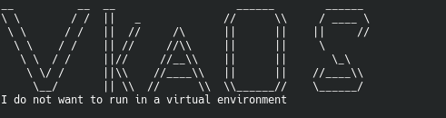
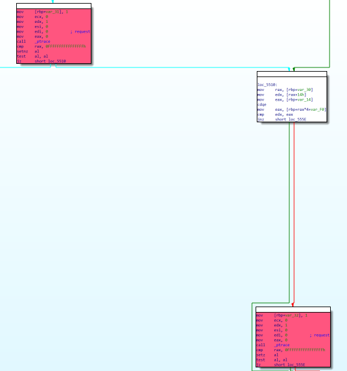
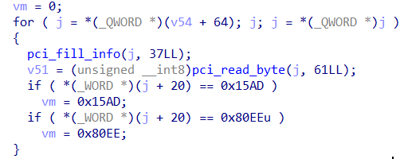
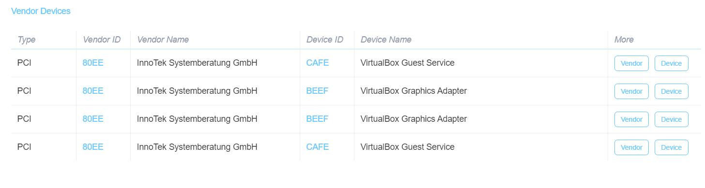
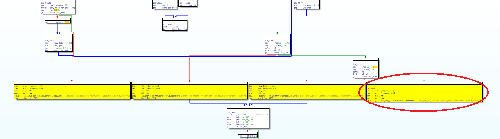

# VKA0S


|   Событие    | Название |      Категория      | Сложность |
| :----------: | :------: | :-----------------: | :-------: |
| VKA-CTF`2020 |  VKA0S   | Обратная разработка | 4-5 курс  |

## Описание

> Автор: Rex
>
> Программа импортозамещения не перестает работать. Нашему курсанту поручили за день разработать свою собственную операционную систему. Когда подошли сроки сдачи, у бедняги ее буквально вырывали из рук, а он, не переставая, кричал: "Она не готова! Еще чуть-чуть!!!". Может быть, ты разберешься что там не так, а то она работает через раз...

## Решение

Поставивь нужные библиотеки можем получить



Для начала отключаем ptrace



Далее происходит проверка **PCI шин**



**0x15AD** соответсвует **VMWare**, **0x80EE** - **VirtualBox**. Это и есть проверки на виртуальность окружения. (Более подробно https://devicehunt.com/view/type/pci/vendor/15AD)



Как раз от этого и зависит дальнейший ход выполнения программы/инициализация комманд.



Нас интересует первая из них (к ней не ведут следы от VMWare && VB, да и она самая большая по размеру комманд)

Далее уже рассматриваем непосредственно движок нашей виртуальной машины (экспорт кода из Ghidra)

      do {
        piVar4 = (int *)operator__(local_528,(long)(i + 1));
        iVar1 = *piVar4;
        piVar4 = (int *)operator__(local_528,(long)i);
        length = iVar1 - *piVar4;
        memcpy(vm_comm,local_510 + (ulong)(ushort)vm_reg[4],(long)length);
        j = 0;
        while (vm_reg = vm_reg, j < length) {
          vm_comm[(long)j] = (&k)[(long)(j + (length + -4) * 7)] ^ vm_comm[(long)j];
          j = j + 1;
        }
        id_command = recognizer((char *)vm_comm);
        executor(id_command,(vm_registers *)vm_reg,stack,&local_510);
        i = i + 1;
        if (vm_reg[4] == 0xe) {
          i = 3;
        }
        if (vm_reg[4] == 0x75) {
          i = 0x14;
        }
        if (vm_reg[4] == 0xe6) {
          i = 0x27;
        }
        if (vm_reg[4] == 0x139) {
          i = 0x35;
        }
        uVar5 = size(local_528);
      } while ((ulong)(long)i <= uVar5);
Попробуем повторить процесс расшифровки комманд
```
d  =[0,0x5,0x9,0x0E,0x15,0x1C,0x23,0x29,0x2F,0x36,0x3B,0x40,0x47,0x4C,0x51,0x58,0x5D,0x62,0x69,0x6E,0x75,0x7A,0x81,0x87,0x8D,0x93,0x98,0x9F,0x0A5,0x0AB,0x0B0,0x0B7,0x0BB,0x0C2,0x0C9,0x0CF,0x0D5,0x0DC,0x0E1,0x0E6,0x0EB,0x0F0,0x0F7,0x0FE,0x104,0x10A,0x110,0x117,0x11E,0x123,0x128,0x12F,0x134,0x139,0x13E,0x143,0x14A,0x151,0x157,0x15D,0x163,0x16A,0x16F,0x174,0x17B]

m = "\x15\x5f\x71\x30\x72\xb3\xc2\xfd\x45\x14\x5f\x74\x42\x33\x0a\x0a\x04\x17\x31\x01\x21\x02\x10\x02\x17\x33\x01\x26\x1f\x0a\x00\x17\x31\x01\x21\x37\x2f\x25\x31\x15\x47\x35\x26\x31\x31\x15\x5a\x18\x08\x06\x09\x01\x73\x6c\x15\x5f\x72\x30\x6f\x15\x5f\x71\x30\x72\x04\x0e\x17\x15\x00\x1a\x0b\x15\x5f\x72\x30\x32\x15\x5f\x71\x30\x6f\x04\x0e\x17\x11\x17\x00\x11\x15\x5f\x72\x30\x32\x15\x5f\x71\x30\x6f\x04\x0e\x17\x15\x00\x1a\x0b\x15\x5f\x71\x30\xc1\x1f\x0a\x00\x17\x30\x01\x24\x14\x5f\x74\x42\x30\x1f\x0a\x00\x17\x33\x01\x27\x37\x2f\x25\x31\x15\x4c\x3b\x24\x25\x31\x15\x68\x37\x2f\x25\x31\x15\xf5\x14\x5f\x73\x42\x33\x1e\x16\x1e\x17\x36\x01\x26\x3b\x24\x25\x31\x10\x68\x36\x00\x7e\x75\x42\x36\x00\x7e\x75\x42\x04\x0e\x17\x23\x1e\x12\x02\x15\x5f\x71\x30\xc1\x15\x5f\x72\x31\x7d\x14\x5f\x73\x42\x33\x14\x5f\x74\x42\x30\x0a\x0a\x04\x17\x31\x01\x21\x02\x10\x02\x17\x33\x01\x26\x37\x2f\x25\x31\x15\x47\x37\x2f\x25\x31\x16\x47\x35\x26\x31\x31\x15\xa7\x18\x08\x06\x09\x01\x72\x5c\x15\x5f\x72\x30\x5c\x15\x5f\x71\x30\xc1\x04\x0e\x17\x15\x00\x1a\x0b"

key = [0xDE,0x0AD,0x0BE,0x0EF,0x0FF,0x0FF,0x0FF,0x78,0x30,0x30,0x30,0x72,0x0FF,0xFF,0x56,0x4B,0x41,0x43,0x54,0x46,0x0FF,0x72,0x65,0x76,0x65,0x72,0x73,0x65]

for i in range(len(d)-1):
    a = d[i+1]-d[i]
    s = ''
    raw_s = ''
    for j in range(a):
        s += chr(ord(m[j+d[i]])^key[7*a-28+j])
        raw_s += str(ord(m[j+d[i]])^key[7*a-28+j])
        raw_s += ' '
    print(s + "	" + raw_s)
```
**Output:**

> moA     0x6d 0x6f 0x41 0x0 0x0
> moC   0x6d 0x6f 0x43 0xaa
> loDrA   0x6c 0x6f 0x44 0x72 0x41
> xorrCrD   0x78 0x6f 0x72 0x72 0x43 0x72 0x44
> putrArC   0x70 0x75 0x74 0x72 0x41 0x72 0x43
> movrCrD   0x6d 0x6f 0x76 0x72 0x43 0x72 0x44
> addrA   0x61 0x64 0x64 0x72 0x41 0x1
> cmprA   0x63 0x6d 0x70 0x72 0x41 0x1c
> jmpls      0x6a 0x6d 0x70 0x6c 0x73 0x0 0x9
> moB    0x6d 0x6f 0x42 0x0 0x1d
> moA     0x6d 0x6f 0x41 0x0 0x0
> **vkaprin   0x76 0x6b 0x61 0x70 0x72 0x69 0x6e**
> moB    0x6d 0x6f 0x42 0x0 0x40
> moA    0x6d 0x6f 0x41 0x0 0x1d
> **vkatest   0x76 0x6b 0x61 0x74 0x65 0x73 0x74**
> moB    0x6d 0x6f 0x42 0x0 0x40
> moA    0x6d 0x6f 0x41 0x0 0x1d
> **vkaprin   0x76 0x6b 0x61 0x70 0x72 0x69 0x6e**
> moA    0x6d 0x6f 0x41 0x0 0xb3
> movrBrA   0x6d 0x6f 0x76 0x72 0x42 0x72 0x41
> loDrB   0x6c 0x6f 0x44 0x72 0x42
> movrArB   0x6d 0x6f 0x76 0x72 0x41 0x72 0x42
> addrA    0x61 0x64 0x64 0x72 0x41 0xa
> modrA.   0x6d 0x6f 0x64 0x72 0x41 0x2e
> addrA   0x61 0x64 0x64 0x72 0x41 0xb3
> loCrA   0x6c 0x6f 0x43 0x72 0x41
> lshrDrC   0x6c 0x73 0x68 0x72 0x44 0x72 0x43
> modrD.   0x6d 0x6f 0x64 0x72 0x44 0x2e
> addrD   0x61 0x64 0x64 0x72 0x44 0xb3
> loCrB   0x6c 0x6f 0x43 0x72 0x42
> movrArD   0x6d 0x6f 0x76 0x72 0x41 0x72 0x44
> moD   0x6d 0x6f 0x44 0xad
> xorrCrD   0x78 0x6f 0x72 0x72 0x43 0x72 0x44
> putrArC   0x70 0x75 0x74 0x72 0x41 0x72 0x43
> addrB   0x61 0x64 0x64 0x72 0x42 0x1
> cmprB   0x63 0x6d 0x70 0x72 0x42 0xe1
> jmpls u   0x6a 0x6d 0x70 0x6c 0x73 0x0 0x75
> moA    0x6d 0x6f 0x41 0x0 0xb3
> moB    0x6d 0x6f 0x42 0x0 0xe1
> loCrA   0x6c 0x6f 0x43 0x72 0x41
> loDrB   0x6c 0x6f 0x44 0x72 0x42
> xorrCrD   0x78 0x6f 0x72 0x72 0x43 0x72 0x44
> putrArC   0x70 0x75 0x74 0x72 0x41 0x72 0x43
> addrA   0x61 0x64 0x64 0x72 0x41 0x1
> addrB   0x61 0x64 0x64 0x72 0x42 0x1
> cmprA   0x63 0x6d 0x70 0x72 0x41 0xe1
> jmpls    0x6a 0x6d 0x70 0x6c 0x73 0x0 0xe6
> vkascan   0x76 0x6b 0x61 0x73 0x63 0x61 0x6e
> **N0NE0   0x4e 0x30 0x4e 0x45 0x30**
> **N0NE0   0x4e 0x30 0x4e 0x45 0x30**
> **vkaFlag   0x76 0x6b 0x61 0x46 0x6c 0x61 0x67**
> moA    0x6d 0x6f 0x41 0x0 0xb3
> moB   0x6d 0x6f 0x42 0x1 0xf
> loCrA   0x6c 0x6f 0x43 0x72 0x41
> loDrB   0x6c 0x6f 0x44 0x72 0x42
> xorrCrD   0x78 0x6f 0x72 0x72 0x43 0x72 0x44
> putrArC   0x70 0x75 0x74 0x72 0x41 0x72 0x43
> addrA   0x61 0x64 0x64 0x72 0x41 0x1
> addrB   0x61 0x64 0x64 0x72 0x42 0x1
> cmprA   0x63 0x6d 0x70 0x72 0x41 0xe1
> jmpls   0x6a 0x6d 0x70 0x6c 0x73 0x1 0x39
> moB .   0x6d 0x6f 0x42 0x0 0x2e
> moA    0x6d 0x6f 0x41 0x0 0xb3
> **vkaprin   0x76 0x6b 0x61 0x70 0x72 0x69 0x6e**

Комманды виртуальной машины интуитивно понятны.

Перед выполнением функций **vka*** (помимо scan), выполняется передача параметров -> **moB, moA**

**vkascan** записывает введенные данные в стек исполняемых команд

Последний вывод vkaprin не выдал нам читаемого результата. Сама функция **vkaFlag** лишь расшифровывает переданную строку. Посмотрев какие строки использовались, можно перебрать не использованные, но все же попробуем для начала передать ту же строку что должна выводится в конце. Это как раз попадает под две NOP-подобные инструкции N0NE0

Можно подать на вход что угодно, а исправить команды уже после их декодирования, таким образом заменим

> N0NE0 -> moB (\x6d\x6f\x42\x00\x2e)
>
> N0NE0 -> moA (\x6d\x6f\x41\x00\xb3)
>

Проходим через vkaFlag и в итоге получаем наш флаг

> VKACTF{w0w_y0u_f0und_50m3_53cr37_1n_7h3_VK40S}