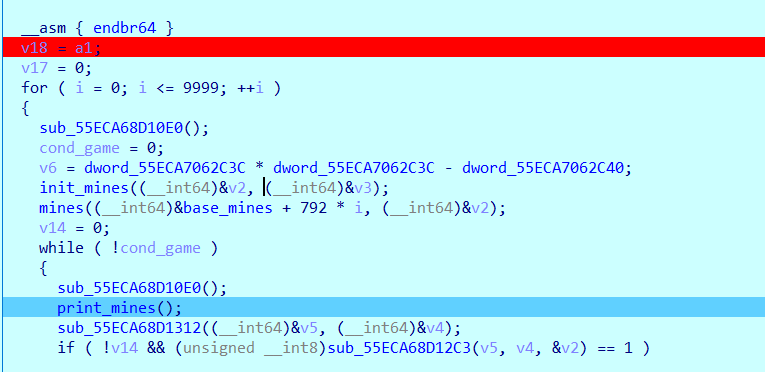
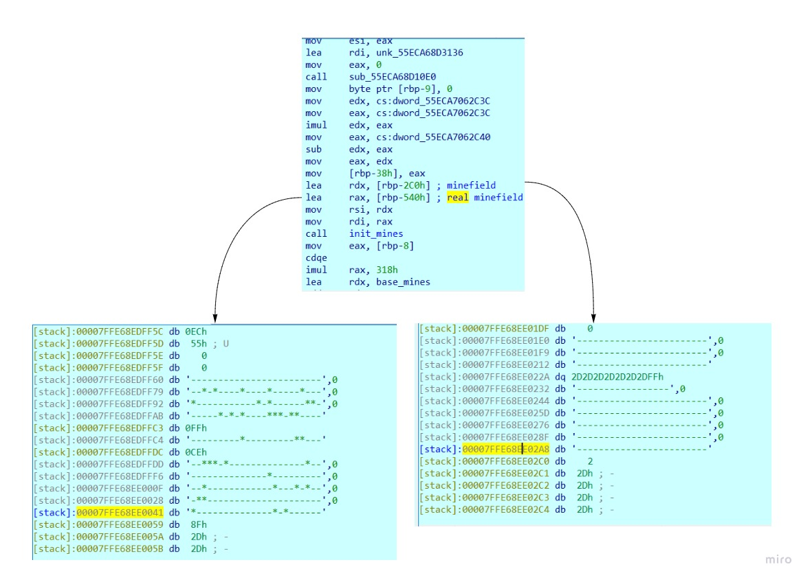
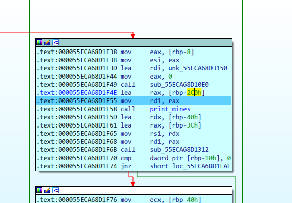
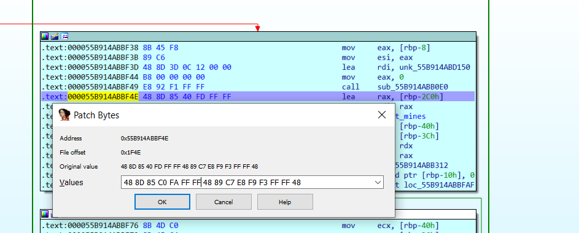
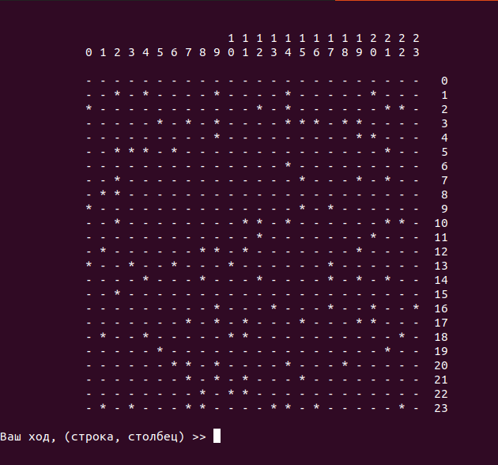
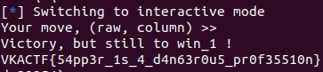

# Инженерная подготовка

|   Событие    |       Название        |      Категория      | Стоимость |
| :----------: | :-------------------: | :-----------------: | :-------: |
| VKA-CTF`2020 | Инженерная подготовка | Обратная разработка | 1-3 курс  |

## Описание

> Автор: Rex
>
> Наш преподаватель по инженерной подготовке совсем спятил. Он сказал, что я должен разминировать 10.000 минных полей ради пятерки на экзамене.

## Решение

Итак, нам необходимо пройти сапера 10.000 раз. По сути интересны лишь несколько функций:

 

Посмотрев на инициализацию минных полей находим настоящее поле, с которым идет сравнение и наше - игровое:



Вывод минного поля:



Заменим его на вывод реального:



Получим подобный вывод:



Вот теперь можно играть) Следующий скрипт представляет собой одно из решений:
```
#!/usr/bin/env python3

from pwn import *
from time import sleep
import re


exe = "./minesweeper" 

context.binary = exe
elf = ELF(exe)

########## LAUNCH SETTINGS ##########

HOST = "" 
PORT = 0

host = args.HOST or HOST
port = int(args.PORT or PORT)


def local(argv=[], *a, **kw):
  '''Execute the target binary locally'''
  if args.GDB:
    return gdb.debug([exe] + argv, gdbscript=gdbscript, *a, **kw)
  else:
    return process([exe] + argv, *a, **kw)
def remote(argv=[], *a, **kw):
  '''Connect to the process on the remote host'''
  io = connect(host, port)
  if args.GDB:
    gdb.attach(io, gdbscript=gdbscript)
  return io


def start(argv=[], *a, **kw):
  '''Start the exploit against the target.'''
  if args.LOCAL:
    return local(argv, *a, **kw)
  else:
    return remote(argv, *a, **kw)
#######################################

########## GDBSCRIPT ##########

gdbscript = """
b main
continue
""".format(**locals())

###############################

###############################
#							  #
#			SOLVE			  #
#							  #
###############################

io = start()
io.recvuntil("Enter")
io.sendline()

for j in range(10000):
  if j == 0:
    io.recvuntil("New game")
    io.recvuntil("Current game")
    io.recvuntil(":")
    M = io.recvuntil("23")
    solve = re.findall(r"[-*]", str(M))
    io.recv()
  else:
    solve = re.findall(r"[-*]", str(k))
  io.clean()
  for i in range(len(solve)):

    if solve[i] == '-':
      d = i//24
      m = i%24
      line = str(d) + ' ' + str(m)
      io.sendline(line)
      try:
      k = io.recvuntil(" 23")
      except:
       print(k)
        io.interactive()
      try:
        io.recv()
      except:
        print(k)
        print(solve)
        io.interactive()
      if "New game" in str(k):
        break
  print('Текущий раунд %d' % j)

```

Конечный вывод



Сдаем флаг

> VKACTF{54pp3r_1s_4_d4n63r0u5_pr0f35510n} 

