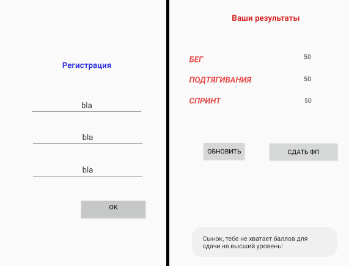
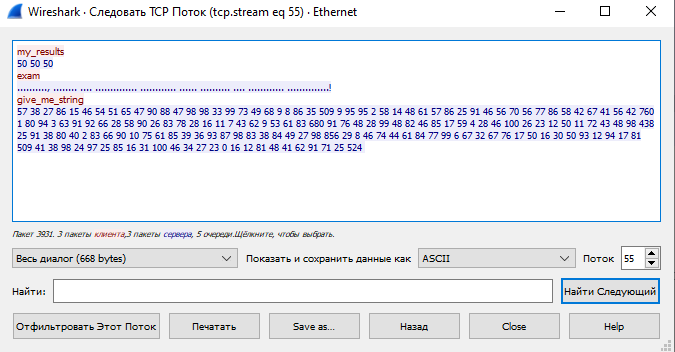
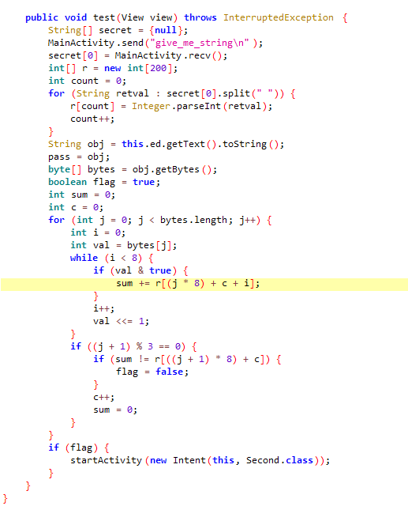
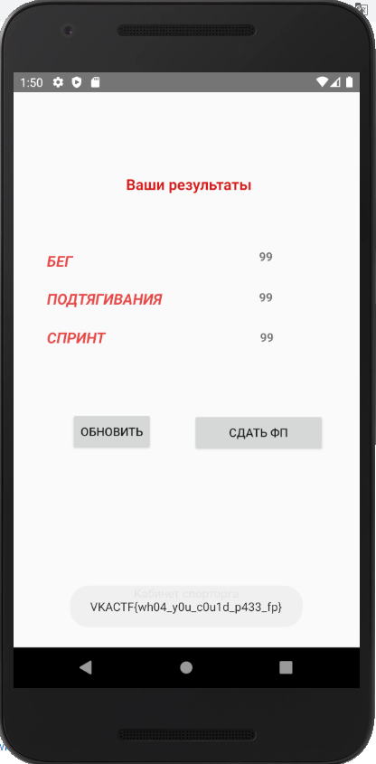

# Экзамен по физподготовке


|   Событие    |         Название         |      Категория      | Сложность |
| :----------: | :----------------------: | :-----------------: | :-------: |
| VKA-CTF`2020 | Экзамен по физподготовке | Обратная разработка | 1-3 курс  |

## Описание

> Автор: Rex
>
> Наш спортивный организатор разработал приложение в котором все желающие курсанты могут сдать физическую подготовку не выходя на улицу. Экзамен включает в себя 3 упражнения, оцениваемые по 100-бальной шкале. Чтобы сдать на высший уровень надо набрать больше 270 баллов. Из надежных источников мне известно, что система безопасности хромает...
>

## Решение



Залогинившись под случайным пользователем переходим в свой личный кабинет физподготовки, обновляем результаты и видим, что нам их не хватает для сдачи на высший уровень. Воспользовавшись apktool и посмотрев код приложения, можем увидеть взаимодействие нашего приложение с сервером посредством сокета. Сэмулировать устройство для запуска приложения может помочь Android Studio, достав из кода IP = 35.228.163.77 слушаем общение в wireshark (фильтр ip.dst == 35.228.163.77):



При попытке войти в личный кабинет спортивного организатора на сервер отправляется "give_me_string" и принимается 175 чисел. Проверка пароля происходит следующим образом:



Введенный пароль представляется в виде битовой строки. Если во время побитового прохождения встречается 1, то числа находящееся на соответствующей позиции переданной с сервера строки суммируются и сравниваются с контрольной суммой каждые 3 байта. При общении с сервером можем заметить что строки всегда разные. Попробуем взять несколько из них (5 было вполне достаточно) и решить систему с помощью старого доброго Z3:
```
from z3 import *

b = BoolVector("b", 24)

m0 = [..your_string..]
m1 = [..your_string..]
m2 = [..your_string..]
m3 = [..your_string..]
m4 = [..your_string..]

s = Solver()

bin_pas = ""

for j in range(0, 175, 25):
    task0 = ''
    task1 = ''
    task2 = ''
    task3 = ''
    task4 = ''

    for i in range(24):
        task0 += b[i]*m0[i+j]
        task1 += b[i]*m1[i+j]
        task2 += b[i]*m2[i+j]
        task3 += b[i]*m3[i+j]
        task4 += b[i]*m4[i+j]
    
    s.add(task0 == m0[24+j])
    s.add(task1 == m1[24+j])
    s.add(task2 == m2[24+j])
    s.add(task3 == m3[24+j])
    s.add(task4 == m4[24+j])
    
    if s.check() == sat:
        for i in range(24):
            if(s.model()[b[i]]==True):
                bin_pas += '1'
            else:
                bin_pas += '0'
    s.reset()

password = ''

for i in range(0, len(bin_pas), 8):
    bin_int = int(bin_pas[i:i+8],2)
    password += chr(bin_int)

print(password)
```

Наш пароль:

> p@ssW0rD_f0r_sp0rt0RG

Повысив себе балы, проверяем свои результаты в личном кабинете и пробуем сдать ФП



Сдаем флаг:

> VKACTF{wh04_y0u_c0u1d_p433_fp}