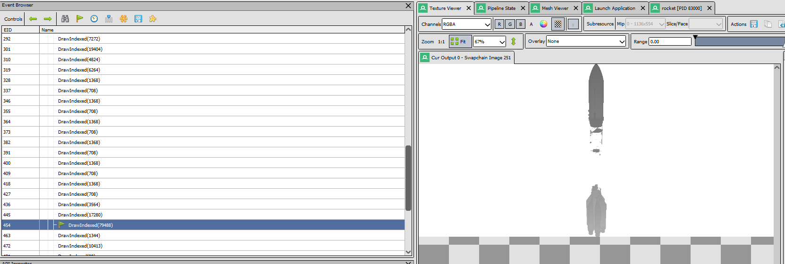
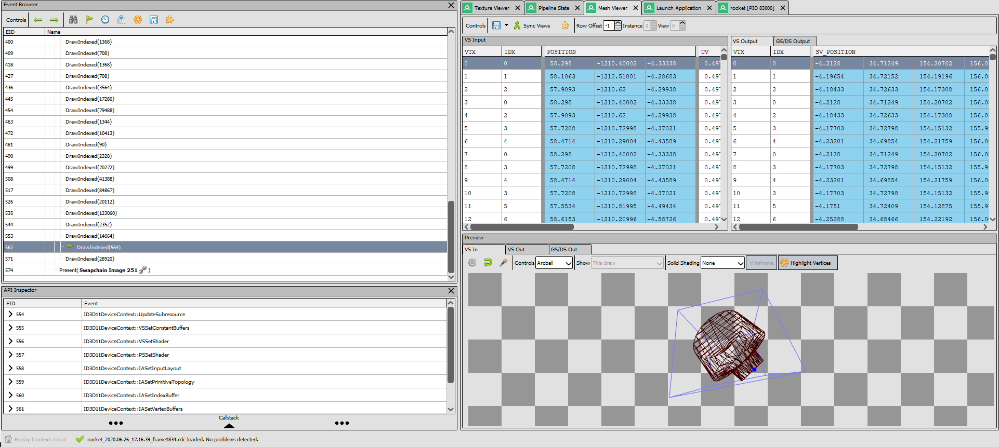
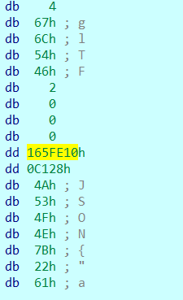
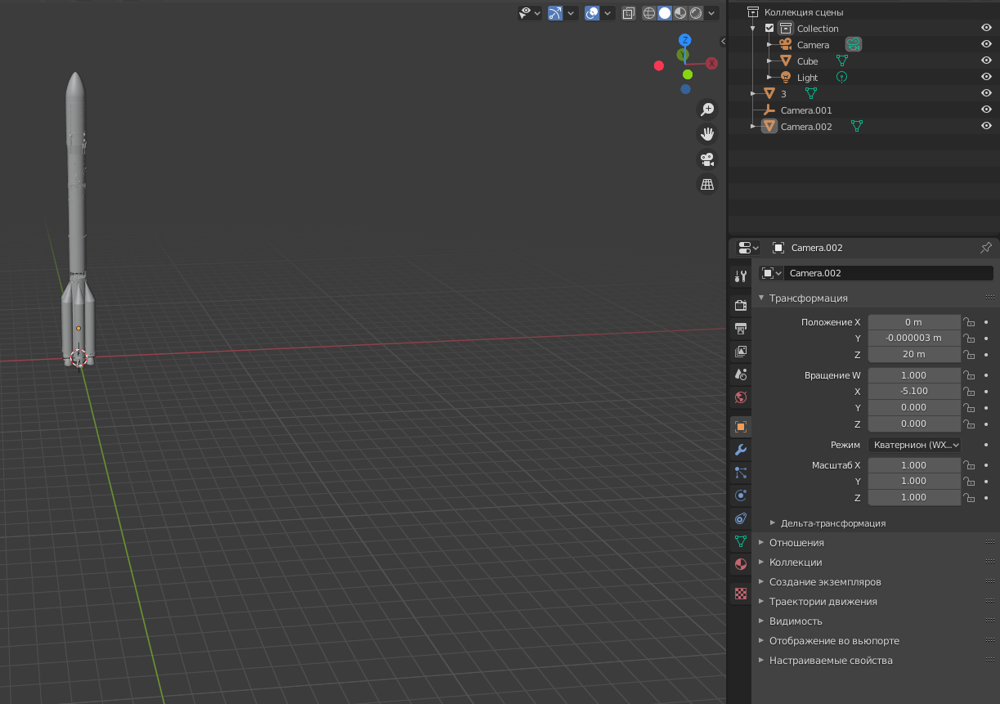
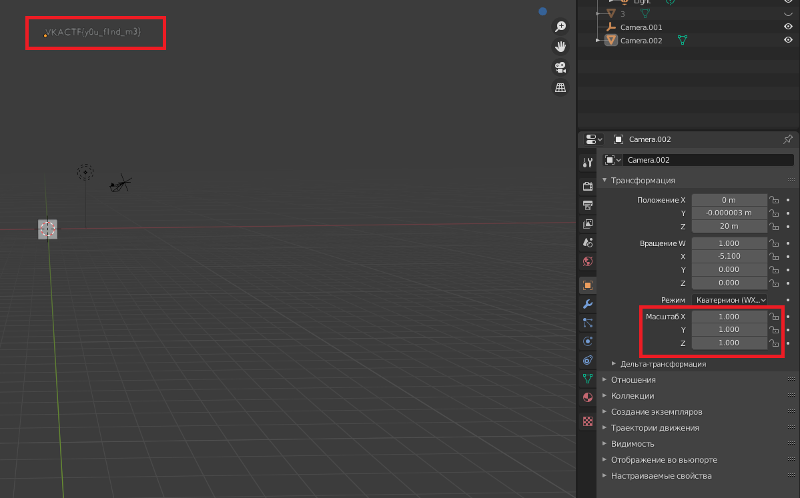

# Как тебе такое, Илон Маск?


|   Событие    |          Название          |      Категория      | Сложность |
| :----------: | :------------------------: | :-----------------: | :-------: |
| VKA-CTF`2020 | Как тебе такое, Илон Маск? | Обратная разработка |  Выпуск   |

## Описание

> Автор: Rex
>
> 
>
> Чтобы дать отпор Илону нам пришлось очень быстро готовить к запуску новую ракету, даже разукрасить не успели. Хотя проблема не в этом...Может разберешься почему она не может взлететь?

## Решение

Судя по таблице импорта мы имеем дело с **Directx 11**


Попробуем воспользоваться графическим отладчик для D3D11 - RenderDoc






Ни одна из частей ракеты не является флагом, он не передается на отрисовку - будем иметь в виду.

Посмотрим где хранится модель ракеты

Поиск binwalk  и тд не дадут результатов, модель сжата


После decompress делаем поиск по строкам и находим наш формат хранения модели - **gltf**



Формат заголовка следующий


Размер файла 0x165FE10

Сдампим файл для анализа
```
auto fname, address, size;
address = 0x1E363564040;
size = 0x165FE10;
fname = "C:\\path\\to\\file\\bin.dump";
auto file= fopen(fname, "wb");
savefile(file, 0, address, size);
fclose(file);
```
Меняем разрешение файла на **gltf**, загружаем в  **Blender** и лицезреем нашу модель



Просмотрев каждый объект, наше внимание может привлечь **Camera.002** (у нее **scale** = 0 и при отображении ее не будет видно)

Поставив масштаб X, Y, Z  больше нуля, видим наш флаг



Сдаем флаг

> VKACTF{y0u_f1nd_m3}