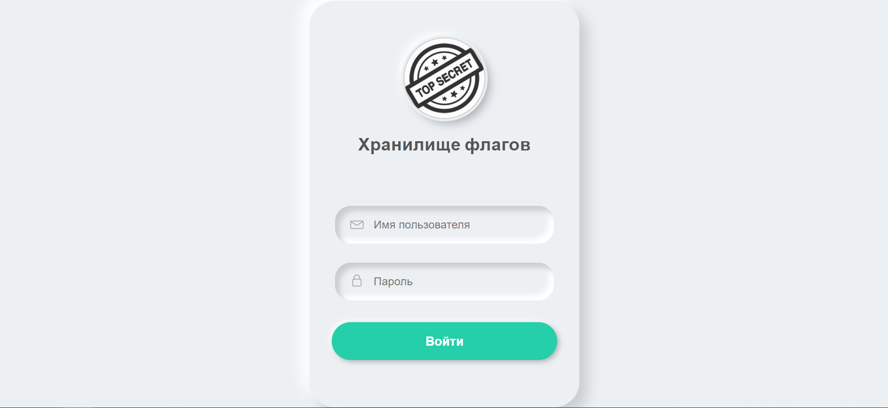

## Хранилище флагов

| Событие | Название | Категория | Сложность |
|:--------|:---------|:----------|----------:|
| VKA-CTF`2020 | Хранилище флагов | Web | АБИТУРА |

### Описание
> Автор: [ 𝕂𝕣𝕒𝕦𝕤𝕖 ]
>
> Наша разведка нашла подозрительный [сайт](https://flag-store.vkactf.tk) одной крупной военной организации предполагаемого противника. Нам кажется, что он хранит то, что нам нужно. Помогите узнать секреты **владельца сайта**.

### Решение

Переходим на сайт и видим форму авторизации. Пробуем вставить кавычку и видим ошибку:
```
Warning: SimpleXMLElement::xpath(): Invalid predicate in /var/www/html/index.php on line 42
```
Понимаем, что запрос обрабатывается с помощью [XPath](https://ru.wikipedia.org/wiki/XPath).
Зайдя в исходный код страницы, находим [ссылку](/index.php/src/) на исходники приложения.
Видим, что пользовательский ввод через поля **login** и **password** фильтруется:
```php
$blacklist = Array('or','0', '1', '2', '3', '4', '5', '6', '7', '8', '9');
``` 
Также, наюблюдаем очень странную проверку верности введённых пользователем данных
```php
$query = "//users/user[login/text()='$login' and password/text()='$pass']";

$result = $xml->xpath($query);
if(!$result){
    echo "Неверные логин или пароль";
}
else{
    $user_data = $xml->xpath("//users/user[login/text()='$login']")[0];
    $flag = $user_data->flag;
    echo "Твой флаг: ".$flag;
}
```
Видим, что нам нужно провести инъекцию в поле **password** так, чтобы запрос был верным и выдал хотя бы один результат, а в поле **login** ввести необходимого нам пользователя (из описания задания можно понять, что нам необходим **admin**).

Учитывая фильтры, простейшая инъекция:
```
'] | //* | /foo[bar='
```

**Флаг:**

> vka{51mpl3_xp47h_vuln3r4b1l17y}