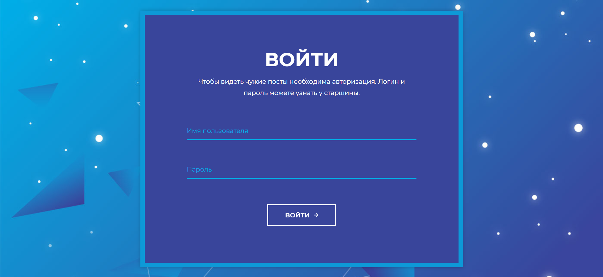

## Блог

| Событие | Название | Категория | Сложность |
|:--------|:---------|:----------|----------:|
| VKA-CTF`2020 | Блог | Web | 1-3 курс |

### Описание
> Автор: [ 𝕂𝕣𝕒𝕦𝕤𝕖 ]
>
> Военнослужащим по статусу их службы не рекомендуется создавать страницы в соцсетях, вести блоги и выкладывать какую-либо информацию о себе. Мы попытались найти выход из положения и создали свой [сервис](https://blog.vkactf.tk/).

### Решение



На страницы входа не работают различные обходы авторизации. Брутфорсом директорий на `/solr/` находим сервис [Apache Solr](https://lucene.apache.org/solr/)

Версия приложения уязвима к RCE ([CVE-2019-17558](https://nvd.nist.gov/vuln/detail/CVE-2019-17558)). 
Используем `metasploit` для его реализации.

На сервере данные "ядер" хранятся по `/var/solr/data/`. Видим там core `users-passwords`, которого нет на web морде, и его данные по `/var/solr/data/users-passwords/data/index`
```bash
> cat cat _0.fdt
?�lLucene50StoredFieldsFastData>G%��@3�{����������978-064172344danield41i3l_p4ssw0rd)�142310334richardmySecurePass123*�85799587*�ardojASokdad30sdASD*�93398817MT�elonion-pepper-salt�(���l
```
Видим как минимум креды одного пользователя `daniel:d41i3l_p4ssw0rd`. Используем их, чтобы авторизоваться

При просмотре постов других пользователей в URI можно заметить уязвимую к `IDOR` строку `/user/<num>`. Используя это, замечаем, что доступ к `/user/1` запрещён.

Пробуя ввести вместо цифр буквы, получаем ошибку, в результате которой появляется debug-mode страница. Количества строк кода приложения, которые мы видим в результате данной ошибки, достаточно, чтобы получить секретный ключ приложения.

Используем его, чтобы сгенерировать `cookie` пользователя `admin` и посмотреть его посты.

**Флаг:**

> vka{d3bu6_m0d3_c4n_pl4y_4_b4d_j0k3}